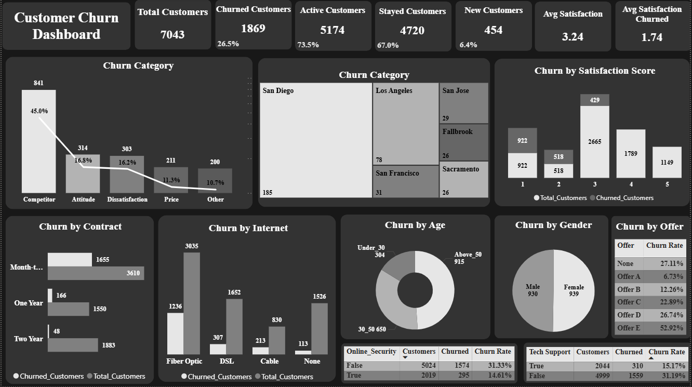

#Customer Churn Analysis

#Project Objective
This project explores customer churn in a telecom company using SQL and Power BI. The goal was to understand customer behavior, identify the main reasons customers leave, and discover which factors are most related to churn. The analysis focuses on customer demographics, service usage, contract types, satisfaction levels, promotional offers, and location data. This project was created as part of my Data Analyst portfolio to demonstrate skills in data exploration, SQL querying, dashboard development, and business insight generation.

## Dataset Description
This dataset represents customers of a telecommunications company and contains over 7,000 customer records. The data covers various aspects of the customer journey, including demographic characteristics, service subscriptions, customer satisfaction, account status, and location information.

## Tools Used

* SQL Server (T-SQL) for data extraction, joins, aggregations, and KPI calculations
* Power BI for dashboard creation and data visualization

## Data Cleaning

Several data quality checks were performed before starting the analysis:

* Reviewed all tables for missing or invalid values
* Verified relationships between tables using Customer_ID
* Checked for duplicate records
* Corrected data types where needed for calculations and reporting
* Converted satisfaction scores to numeric format for average calculations
* Created age groups using CASE statements (Under 30, 30–50, Above 50)
* Filtered churn-specific analyses to include only churned customers when appropriate
* Validated calculations and aggregations to ensure accurate reporting

---

## Exploratory Data Analysis

### Customer Overview

The dataset contains 7,043 customers. Among them:

* 1,869 customers churned (26.5%)
* 4,720 customers stayed (67.0%)
* 454 customers recently joined (6.4%)

The average satisfaction score across all customers is 3.24. However, the average score drops to 1.74 among churned customers, suggesting a strong relationship between satisfaction and customer retention.

### Churn Reasons

Competitor-related reasons are the most common cause of churn, accounting for 45% of all churned customers (841 customers). Other important reasons include:

* Attitude: 16.8%
* Dissatisfaction: 16.2%
* Price: 11.3%
* Other reasons: 10.7%

### Churn by Contract Type

Customers on month-to-month contracts show the highest churn levels, with 1,655 churned customers out of 3,610 total customers. One-year and two-year contracts experience much lower churn, indicating that longer commitments are associated with stronger customer retention.

### Churn by Internet Type

Fiber Optic customers have the highest churn volume, with 1,236 churned customers out of 3,035 total customers. DSL and Cable customers show lower churn levels, while customers without internet service have the lowest churn.

### Churn by Age Group

Customers above 50 years old represent the highest number of churned customers (915), followed by customers aged 30–50 (650). Customers under 30 have the lowest churn count (304).

### Churn by Gender

Churn is almost evenly distributed between male and female customers, suggesting that gender has little impact on customer churn.

### Churn by Offers

Offer E is associated with the highest churn rate at 52.92%, while Offer A has the lowest churn rate at 6.73%. Customers who received no offer show a churn rate of 27.11%, suggesting that some promotional offers may positively influence customer retention.

### Churn by Additional Services

Customers without Online Security have a churn rate of 31.33%, compared to 14.61% for customers who use the service.

Similarly, customers without Premium Tech Support have a churn rate of 31.19%, while customers with Premium Tech Support show a much lower churn rate of 15.17%.

### Churn by Satisfaction Score

Customers with the lowest satisfaction scores account for the largest number of churned customers. As satisfaction scores increase, churn decreases significantly, highlighting customer satisfaction as one of the strongest indicators of retention.

### Churn by City

San Diego records the highest number of churned customers (185), followed by Los Angeles (78) and San Francisco (31).

---

## Dashboard

The Power BI dashboard was designed to provide an interactive overview of customer churn and retention metrics.

### KPIs Included

* Total Customers
* Churned Customers
* Active Customers
* Stayed Customers
* New Customers
* Churn Rate
* Average Satisfaction Score
* Average Satisfaction Score (Churned Customers)

### Visualizations Included

* Churn Categories
* Churn by Contract Type
* Churn by Internet Type
* Churn by Satisfaction Score
* Churn by Gender
* Churn by Age Group
* Churn by Offer
* Churn by City
* Online Security Analysis
* Premium Tech Support Analysis

### Dashboard Preview

---

## Key Insights

1. More than one in four customers have churned, resulting in a churn rate of 26.5%.

2. Competitor-related reasons account for nearly half of all churn cases, making competition the largest driver of customer loss.

3. Customers on month-to-month contracts are significantly more likely to churn than customers on long-term contracts.

4. Customer satisfaction is strongly linked to retention, with churn decreasing as satisfaction scores increase.

5. Fiber Optic customers show the highest churn volume despite being users of a premium internet service.

6. Customers who use Online Security and Premium Tech Support are much less likely to churn.

7. Customers over the age of 50 represent the largest churn segment and may require targeted retention strategies.

8. Promotional offers appear to influence retention, with some offers performing noticeably better than others.

---

## Limitations

* Revenue and monthly billing information were not included in the analysis.
* The dataset represents a single period in time, making trend analysis impossible.
* Customer behavior over multiple years was not available.
* The analysis focuses on descriptive insights and does not include predictive modeling.
* Additional customer engagement and support interaction data could provide deeper insights.

---

## Conclusion

This project provided valuable insights into customer churn by exploring customer demographics, service usage, satisfaction levels, contracts, promotional offers, and geographic information. The analysis identified several factors that are closely associated with customer retention and customer loss.

Using SQL for data exploration and Power BI for visualization, this project demonstrates an end-to-end analytics workflow, from raw data to actionable business insights. It highlights practical skills in data cleaning, analysis, dashboard development, KPI reporting, and data storytelling.
